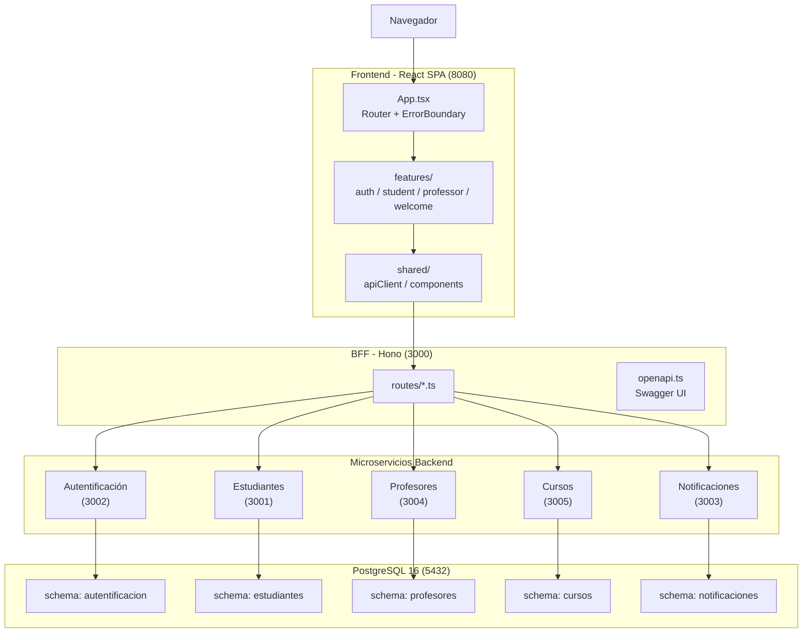

# Portal Educativo — Colegio Bernardo O'Higgins

Plataforma web integral para la gestión académica del Colegio Bernardo O'Higgins. Centraliza la administración de estudiantes, profesores, cursos y asignaturas en un solo sistema accesible desde el navegador.

---

## Objetivo del Negocio

Digitalizar y unificar los procesos administrativos y académicos del colegio, reemplazando planillas manuales y sistemas aislados por una plataforma centralizada que permita:

- **Gestión de estudiantes**: registro, consulta y actualización de datos académicos
- **Gestión de profesores**: administración del cuerpo docente y asignación de materias
- **Administración de cursos**: creación y organización de cursos con sus respectivas asignaturas
- **Autenticación centralizada**: inicio de sesión único para estudiantes, profesores y administradores
- **Notificaciones**: comunicación interna dentro de la plataforma

---

## Tecnologías

| Tecnología | Propósito |
|---|---|
| **Bun** | Runtime JavaScript — ejecuta TypeScript nativamente, reemplaza Node.js + tsx |
| **React 18** | Librería de interfaz de usuario |
| **Hono** | Framework web para microservicios |
| **PostgreSQL 16** | Base de datos relacional |
| **Docker Compose** | Orquestación de contenedores |

---

## Arquitectura



- **Frontend**: aplicación React de página única (SPA) que consume una sola API (el BFF)
- **BFF (Backend for Frontend)**: única puerta de entrada para el frontend, orquesta las llamadas a los microservicios internos
- **Microservicios**: 5 servicios independientes, cada uno con su propio schema de base de datos y responsabilidad de negocio
- **Base de datos**: PostgreSQL con schemas aislados por microservicio

### Microservicios

| Servicio | Puerto | Responsabilidad |
|---|---|---|
| **BFF** | 3000 | Orquestación — única API que consume el frontend |
| **Autentificación** | 3002 | Login, registro, manejo de sesiones JWT |
| **Estudiantes** | 3001 | CRUD de estudiantes |
| **Profesores** | 3004 | CRUD de profesores |
| **Cursos** | 3005 | Gestión de cursos, asignaturas y asignaciones |
| **Notificaciones** | 3003 | Notificaciones del sistema |

---

## Cómo Empezar

```bash
git clone <repo>
cd Wep
docker compose up -d
```

La aplicación queda disponible en `http://localhost:8080`.

### Requisitos

- Docker Desktop (o Docker Engine + Docker Compose)
- Puerto 5432, 3000-3005, 8080 libres

---

## Estructura del Repositorio

```
Wep/
├── frontend/Happ/       → Aplicación React (Vite, TailwindCSS, Zustand)
├── backend/App/         → Microservicios backend (Hono, Drizzle ORM, PostgreSQL)
├── docker-compose.yml   → Orquestación de todos los servicios
└── README.md
```

---

## Documentación API

Swagger UI disponible en `GET /docs` del BFF (`http://localhost:3000/docs`). Generado automáticamente desde los schemas Zod usando `@hono/zod-openapi`.
