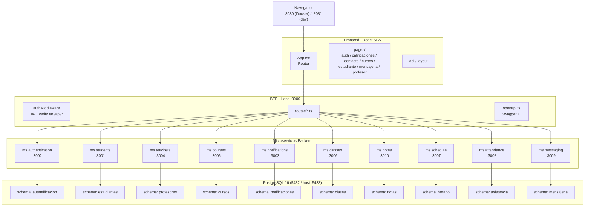

# Portal Educativo — Colegio Bernardo O'Higgins

Plataforma web integral para la gestión académica del Colegio Bernardo O'Higgins. Centraliza la administración de estudiantes, profesores, cursos, clases y asignaturas en un solo sistema accesible desde el navegador.

---

## Tecnologías

| Tecnología | Propósito |
|---|---|
| **Bun** | Runtime JavaScript + test runner del backend |
| **React 18** | Librería de interfaz de usuario |
| **Hono** | Framework web para microservicios |
| **PostgreSQL 16** | Base de datos relacional |
| **Docker Compose** | Orquestación de contenedores (desarrollo) |
| **Kubernetes** | Orquestación de contenedores (producción) — manifests en `k8s/` |
| **Vitest** | Test runner del frontend |

---

## Dependencias

Necesitás tener instalado lo siguiente en tu máquina:

| Dependencia | Versión mínima | Descarga |
|---|---|---|
| **Bun** | 1.3.x | [bun.sh](https://bun.sh) — `powershell -c "irm bun.sh/install.ps1 | iex"` |
| **Docker Desktop** | — | [docker.com](https://www.docker.com/products/docker-desktop/) |
| **Node.js** | 18+ | [nodejs.org](https://nodejs.org/) — solo para el frontend (npm) |
| **kubectl** | — | [kubernetes.io](https://kubernetes.io/docs/tasks/tools/) — opcional, solo para K8s |

> Bun es el runtime principal del proyecto. Se usa para el backend (servidores, tests) y también para gestionar dependencias del frontend si se prefiere.

---

## Cómo Empezar

### 1. Iniciar todos los servicios (Docker)

```bash
docker compose up -d
# Esperar ~30s a que DB y microservicios estén saludables
```

La aplicación queda disponible en:
- **Frontend**: `http://localhost:8080`
- **BFF (API)**: `http://localhost:3000`
- **Documentación API**: `http://localhost:3000/docs`

> PostgreSQL se expone externamente en `localhost:5433` (puerto interno 5432).

### 2. Desarrollo con hot-reload (frontend)

Para editar el frontend con cambios instantáneos sin reconstruir Docker:

```bash
# 1. Parar solo el contenedor del frontend
docker compose stop frontend

# 2. Iniciar el dev server de Vite en local
cd frontend
npm install        # solo la primera vez
npm run dev        # http://localhost:8081
```

El frontend en `localhost:8081` se conecta automáticamente al BFF en `localhost:3000` (Docker). Los cambios en el código se reflejan al instante gracias al HMR de Vite.

> También puedes correr microservicios individuales fuera de Docker con `bun run dev` dentro de cada carpeta, si prefieres desarrollar backend con hot-reload.

### 3. Despliegue en Kubernetes

Los manifests se encuentran en `k8s/`. Para desplegar en un cluster (Minikube, kind, etc.):

```bash
kubectl apply -f k8s/config/namespace.yaml
kubectl apply -f k8s/config/secret.yaml
kubectl apply -f k8s/config/configmap.yaml
kubectl apply -f k8s/database/
kubectl apply -f k8s/microservices/
```

Esto crea:
- Namespace `wep`
- ConfigMap con URLs de servicios internos
- Secret con credenciales de DB
- PostgreSQL 16 (1 réplica, ClusterIP)
- 11 deployments con sus servicios (BFF como LoadBalancer, frontend como LoadBalancer, microservicios como ClusterIP)

> Las imágenes usan `imagePullPolicy: Never` — asumen que están cargadas localmente. Para producción, cambiá a `Always` y usá un registry.

---

## Arquitectura



- **Frontend**: aplicación React SPA que consume una sola API (el BFF)
- **BFF**: única puerta de entrada para el frontend, orquesta los microservicios internos — middleware JWT valida cada request en `/api/*`
- **Microservicios**: 10 servicios independientes, cada uno con su propio schema de DB
- **Base de datos**: PostgreSQL con schemas aislados por microservicio

### Microservicios

| Servicio | Puerto | Responsabilidad |
|---|---|---|
| **BFF** | 3000 | Orquestación — única API que consume el frontend — valida JWT en `/api/*` |
| **ms.students** | 3001 | CRUD de estudiantes |
| **ms.authentication** | 3002 | Login, registro, manejo de sesiones JWT |
| **ms.notifications** | 3003 | Notificaciones del sistema |
| **ms.teachers** | 3004 | CRUD de profesores |
| **ms.courses** | 3005 | Gestión de cursos, asignaturas y asignaciones |
| **ms.classes** | 3006 | Gestión de clases |
| **ms.schedule** | 3007 | Bloques horarios fijos (08:00-16:00) |
| **ms.attendance** | 3008 | Registro de asistencia por clase y estudiante |
| **ms.messaging** | 3009 | Mensajería interna entre usuarios |
| **ms.notes** | 3010 | Gestión de calificaciones de alumnos |

---

## Autenticación JWT

Todas las rutas `/api/*` del BFF están protegidas por un middleware JWT (`backend/bff/src/middleware/auth.ts`).

| Concepto | Detalle |
|---|---|
| **Algoritmo** | HS256 (HMAC-SHA256) |
| **Secret** | `JWT_SECRET` env var — fallback `colegio_ohiggins_secret_changeme` |
| **Rutas públicas** | `/api/auth/login`, `/api/auth/register`, `/api/estudiantes/login`, `/health`, `/docs` |
| **Header esperado** | `Authorization: Bearer <token>` |
| **Respuesta 401** | `{ error: "Token no proporcionado" }` o `{ error: "Token inválido o expirado" }` |

### Flujo

1. **Login** (ruta pública) → el BFF o microservicio genera y devuelve un JWT
2. **Frontend** guarda el token en `sessionStorage` clave `'token'`
3. **Cada request** → `apiClient.ts` lee el token y lo inyecta en el header `Authorization`
4. **BFF** verifica la firma con `hono/jwt.verify()` — si es inválido responde 401
5. El **payload** decodificado queda disponible como `c.get('user')` en las rutas

### Generación de tokens

- **Profesores**: el microservicio de autentificación genera el JWT en `POST /api/auth/login`
- **Estudiantes**: el BFF genera el JWT en `POST /api/estudiantes/login` (el microservicio de estudiantes no maneja auth)

---

## Testing

| Capa | Runner | Comando | Docs |
|---|---|---|---|
| **Frontend** | Vitest | `cd frontend && npm test` | [frontend/README.md](./frontend/README.md) |
| **Backend** | Bun test | `cd backend && bun test` (todos) o `cd backend/<svc> && bun test` (uno) | [backend/README.md](./backend/README.md) |

Ver README de cada capa para detalles de cobertura y estructura de tests. Reporte completo en [`docs/test-report.md`](./docs/test-report.md).

---

## Estructura del Repositorio

```
Wep/
├── frontend/           → Aplicación React (Vite + TailwindCSS + Zustand)
├── backend/
│   ├── bff/            → Backend for Frontend (Hono + Zod OpenAPI)
│   ├── ms.attendance/  → Microservicio de asistencia
│   ├── ms.authentication/→ Microservicio de autenticación
│   ├── ms.classes/     → Microservicio de clases
│   ├── ms.courses/     → Microservicio de cursos
│   ├── ms.students/     → Microservicio de estudiantes
│   ├── ms.schedule/     → Microservicio de horario
│   ├── ms.messaging/    → Microservicio de mensajería
│   ├── ms.notes/        → Microservicio de notas
│   ├── ms.notifications/→ Microservicio de notificaciones
│   └── ms.teachers/     → Microservicio de profesores
├── k8s/                → Manifiestos de Kubernetes
│   ├── config/         →   Namespace, ConfigMap, Secret
│   ├── database/       →   PostgreSQL deployment + service
│   └── microservices/  →   Deployments + services de cada servicio
├── docker-compose.yml  → Orquestación Docker para desarrollo
└── README.md
```

---

## Documentación API

Swagger UI disponible en `GET /docs` del BFF (`http://localhost:3000/docs`). Generado automáticamente desde los schemas Zod usando `@hono/zod-openapi`.
