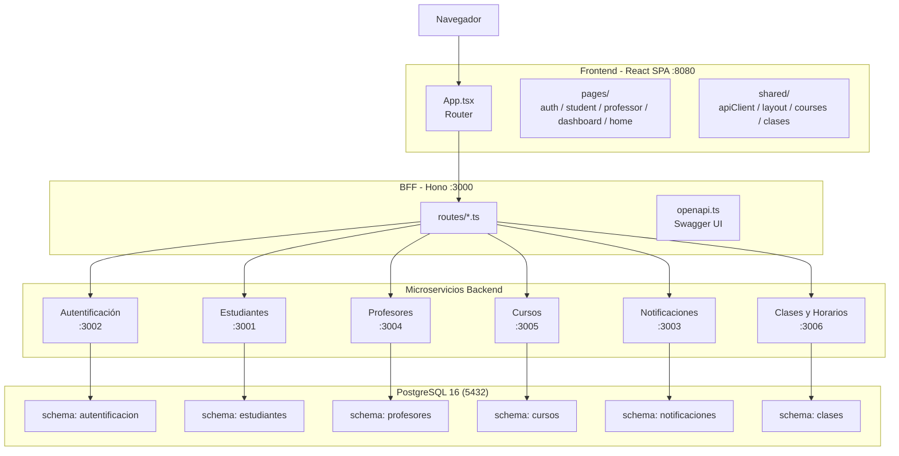

# Portal Educativo — Colegio Bernardo O'Higgins

Plataforma web integral para la gestión académica del Colegio Bernardo O'Higgins. Centraliza la administración de estudiantes, profesores, cursos, clases y asignaturas en un solo sistema accesible desde el navegador.

---

## Tecnologías

| Tecnología | Propósito |
|---|---|
| **Bun** | Runtime JavaScript — ejecuta TypeScript nativamente |
| **React 18** | Librería de interfaz de usuario |
| **Hono** | Framework web para microservicios |
| **PostgreSQL 16** | Base de datos relacional |
| **Docker Compose** | Orquestación de contenedores |
| **Vitest** | Test runner del frontend |
| **Bun Test** | Test runner del backend |

---

## Arquitectura



- **Frontend**: aplicación React de página única (SPA) que consume una sola API (el BFF)
- **BFF (Backend for Frontend)**: única puerta de entrada para el frontend, orquesta las llamadas a los microservicios internos
- **Microservicios**: 6 servicios independientes, cada uno con su propio schema de base de datos y responsabilidad de negocio
- **Base de datos**: PostgreSQL con schemas aislados por microservicio

### Microservicios

| Servicio | Puerto | Responsabilidad |
|---|---|---|
| **BFF** | 3000 | Orquestación — única API que consume el frontend |
| **Autentificación** | 3002 | Login, registro, manejo de sesiones JWT |
| **Estudiantes** | 3001 | CRUD de estudiantes |
| **Profesores** | 3004 | CRUD de profesores |
| **Cursos** | 3005 | Gestión de cursos, asignaturas y asignaciones |
| **Clases y Horarios** | 3006 | Gestión de clases y bloques horarios |
| **Notificaciones** | 3003 | Notificaciones del sistema |

---

## Estructura del Repositorio

```
Wep/
├── frontend/           → Aplicación React (Vite + TailwindCSS + Zustand)
│   ├── src/
│   │   ├── pages/      → Componentes de página agrupados por feature
│   │   ├── shared/     → Componentes y servicios compartidos
│   │   ├── config/     → Constantes de rutas
│   │   └── common/     → Utilidades generales
│   └── vitest.config.ts
├── backend/
│   ├── bff/            → Backend for Frontend (Hono + Zod OpenAPI)
│   └── microservicios/ → 6 microservicios independientes
│       ├── autentificacion/
│       ├── estudiantes/
│       ├── profesores/
│       ├── cursos/
│       ├── clases/
│       └── notificaciones/
├── docker-compose.yml  → Orquestación de todos los servicios
└── README.md
```

---

## Testing

### Frontend (Vitest)

```bash
cd frontend
npm test              # Modo watch
npm run test:run      # Ejecución única
npm run test:coverage # Con reporte de cobertura (threshold 80%)
```

### Backend (Bun Test)

```bash
cd backend/microservicios/<servicio>
bun test              # Ejecución única
bun test --coverage   # Con reporte de cobertura
```

---

## Cómo Empezar

```bash
git clone <repo>
cd Wep
docker compose up -d
```

La aplicación queda disponible en `http://localhost:8080`.

### Requisitos

- Docker Desktop (o Docker Engine + Docker Compose)
- Puerto 5432, 3000-3006, 8080 libres

---

## Documentación API

Swagger UI disponible en `GET /docs` del BFF (`http://localhost:3000/docs`). Generado automáticamente desde los schemas Zod usando `@hono/zod-openapi`.
