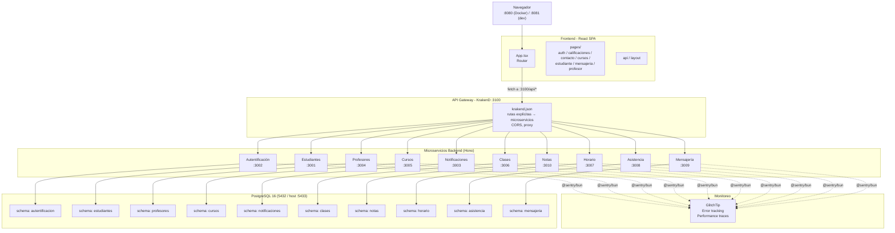

# Portal Educativo — Colegio Bernardo O'Higgins

Plataforma web integral para la gestión académica del Colegio Bernardo O'Higgins. Centraliza la administración de estudiantes, profesores, cursos, clases y asignaturas en un solo sistema accesible desde el navegador.

---

## Tecnologías

| Tecnología | Propósito |
|---|---|
| **Bun** | Runtime JavaScript + test runner del backend |
| **React 18** | Librería de interfaz de usuario |
| **Hono** | Framework web para microservicios |
| **PostgreSQL 16** | Base de datos relacional |
| **Docker Compose** | Orquestación de contenedores (desarrollo) |
| **Kubernetes** | Orquestación de contenedores (producción) — manifests en `k8s/` |
| **KrakenD** | API Gateway — punto de entrada único para el frontend (puerto 3100) |
| **GlitchTip** | Plataforma de error tracking y performance monitoring (Sentry-compatible) |
| **Vitest** | Test runner del frontend |

---

## Dependencias

Necesitás tener instalado lo siguiente en tu máquina:

| Dependencia | Versión mínima | Descarga |
|---|---|---|
| **Bun** | 1.3.x | [bun.sh](https://bun.sh) — `powershell -c "irm bun.sh/install.ps1 | iex"` |
| **Docker Desktop** | — | [docker.com](https://www.docker.com/products/docker-desktop/) |
| **Node.js** | 18+ | [nodejs.org](https://nodejs.org/) — solo para el frontend (npm) |
| **kubectl** | — | [kubernetes.io](https://kubernetes.io/docs/tasks/tools/) — opcional, solo para K8s |

> Bun es el runtime principal del proyecto. Se usa para el backend (servidores, tests) y también para gestionar dependencias del frontend si se prefiere.

---

## Cómo Empezar

### 1. Iniciar todos los servicios (Docker)

```bash
docker compose up -d
# Esperar ~30s a que DB y microservicios estén saludables
```

La aplicación queda disponible en:
- **Frontend**: `http://localhost:8080`
- **API (via KrakenD)**: `http://localhost:3100`
- **Documentación API**: `http://localhost:3000/docs` (BFF original, si está expuesto)
- **GlitchTip UI**: `http://localhost:8000` (si está configurado)

> PostgreSQL se expone externamente en `localhost:5433` (puerto interno 5432).

### 2. Desarrollo con hot-reload (frontend)

Para editar el frontend con cambios instantáneos sin reconstruir Docker:

```bash
# 1. Parar solo el contenedor del frontend
docker compose stop frontend

# 2. Iniciar el dev server de Vite en local
cd frontend
npm install        # solo la primera vez
npm run dev        # http://localhost:8081
```

El frontend en `localhost:8081` se conecta automáticamente a KrakenD en `localhost:3100` (Docker). Los cambios en el código se reflejan al instante gracias al HMR de Vite.

> También puedes correr microservicios individuales fuera de Docker con `bun run dev` dentro de cada carpeta, si prefieres desarrollar backend con hot-reload.

### 3. Despliegue en Kubernetes

Los manifests se encuentran en `k8s/`. Para desplegar en un cluster (Minikube, kind, etc.):

```bash
kubectl apply -f k8s/config/namespace.yaml
kubectl apply -f k8s/config/secret.yaml
kubectl apply -f k8s/config/configmap.yaml
kubectl apply -f k8s/database/
kubectl apply -f k8s/microservices/
```

Esto crea:
- Namespace `wep`
- ConfigMap con URLs de servicios internos
- Secret con credenciales de DB
- PostgreSQL 16 (1 réplica, ClusterIP)
- 12 deployments con sus servicios (KrakenD como entrada, frontend como LoadBalancer, microservicios como ClusterIP)

> Las imágenes usan `imagePullPolicy: Never` — asumen que están cargadas localmente. Para producción, cambiá a `Always` y usá un registry.

---

## Arquitectura



### Flujo de peticiones

1. **Frontend** (React SPA) envía todas las peticiones a `http://localhost:3100/api/*`
2. **KrakenD** recibe la petición, aplica CORS y la enruta al microservicio correspondiente según el patrón de URL
3. **Microservicio** procesa la lógica de negocio y accede a su schema de PostgreSQL
4. Si hay errores o trazas de rendimiento, se envían a **GlitchTip** via `@sentry/bun`

### KrakenD — API Gateway

**KrakenD** es un API Gateway de alto rendimiento escrito en Go, sin estado y configurable via JSON. En este proyecto:

- **Punto de entrada único**: el frontend solo conoce `localhost:3100`, no los puertos internos de cada microservicio
- **Enrutamiento explícito**: cada endpoint está definido en `backend/krakend/krakend.json` con su método HTTP, ruta y backend destino
- **CORS**: se maneja a nivel de gateway, evitando configurar CORS en cada microservicio
- **Sin plugins**: se usa en modo "pure config" — sin plugins Go, sin JWT validation a nivel gateway
- **Proxy directo**: KrakenD reenvía la petición al microservicio correspondiente (ej. `/api/students` → `http://ms-students:3001/students`)

### GlitchTip — Error Tracking y Performance

**GlitchTip** es una plataforma open-source para monitoreo de errores y rendimiento, compatible con el protocolo de Sentry. En este proyecto:

- **Cada microservicio** tiene su propia integración con `@sentry/bun` en las carpetas `glitchtip/` y `tracing/`
- **Inicialización**: al arrancar el servicio, se configura el DSN vía `SENTRY_DSN` (env var). Si no está definida, se omite la inicialización.
- **Middleware**: cada request se envuelve en un `Sentry.startSpan()` para capturar trazas de rendimiento
- **Error handler**: captura errores no manejados y los reporta automáticamente
- **DSN normalization**: `@sentry/bun@10.x` rechaza UUIDs con guiones — el init normaliza el DSN usando `new URL()` y removiendo guiones del public key
- **Performance traces**: se habilitan con `SENTRY_TRACES_SAMPLE_RATE` (entero 0-100, default 0)

---

## Microservicios

| Servicio | Puerto | Responsabilidad |
|---|---|---|
| **KrakenD** | 3100 | API Gateway — punto de entrada único para el frontend |
| **Estudiantes** | 3001 | CRUD de estudiantes |
| **Autentificación** | 3002 | Login, registro, manejo de sesiones JWT |
| **Notificaciones** | 3003 | Notificaciones del sistema (Novu) |
| **Profesores** | 3004 | CRUD de profesores |
| **Cursos** | 3005 | Gestión de cursos, asignaturas y asignaciones |
| **Clases** | 3006 | Gestión de clases |
| **Horario** | 3007 | Bloques horarios fijos (08:00-16:00) |
| **Asistencia** | 3008 | Registro de asistencia por clase y estudiante |
| **Mensajería** | 3009 | Mensajería interna entre usuarios |
| **Notas** | 3010 | Gestión de calificaciones de alumnos |

---

## Testing

| Capa | Runner | Comando | Docs |
|---|---|---|---|
| **Frontend** | Vitest | `cd frontend && npm test` | [frontend/README.md](./frontend/README.md) |
| **Backend** | Bun test | `cd backend && bun test` (todos) o `cd backend/microservicios/<svc> && bun test` (uno) | [backend/README.md](./backend/README.md) |

Ver README de cada capa para detalles de cobertura y estructura de tests. Reporte completo en [`docs/test-report.md`](./docs/test-report.md).

---

## Estructura del Repositorio

```
Wep/
├── frontend/           → Aplicación React (Vite + TailwindCSS + Zustand)
├── backend/
│   ├── krakend/        → API Gateway (KrakenD 2.13, configuración JSON pura)
│   └── microservicios/ → 10 microservicios independientes
│       ├── autentificacion/
│       ├── estudiantes/
│       ├── profesores/
│       ├── cursos/
│       ├── clases/
│       ├── horario/
│       ├── asistencia/
│       ├── notificaciones/
│       ├── mensajeria/
│       └── notas/
├── k8s/                → Manifiestos de Kubernetes
│   ├── config/         →   Namespace, ConfigMap, Secret
│   ├── database/       →   PostgreSQL deployment + service
│   └── microservices/  →   Deployments + services de cada servicio
├── docker-compose.yml  → Orquestación Docker para desarrollo
└── README.md
```

---

## Documentación API

Swagger UI disponible en `GET /docs` del BFF original (`http://localhost:3000/docs`). Generado automáticamente desde los schemas Zod usando `@hono/zod-openapi`.

---

## Variables de Entorno

Cada servicio requiere ciertas variables de entorno. Las principales:

| Variable | Servicios | Descripción |
|---|---|---|
| `SENTRY_DSN` | Todos los microservicios | DSN de GlitchTip/Sentry para error tracking |
| `SENTRY_ENVIRONMENT` | Todos | Entorno (`development`, `production`) |
| `SENTRY_TRACES_SAMPLE_RATE` | Todos | Muestreo de trazas 0-100 (default 0) |
| `JWT_SECRET` | ms-auth | Secreto para firmar/verificar JWT |
| `NOVU_SECRET_KEY` | ms-notifications | API key de Novu para notificaciones push |
