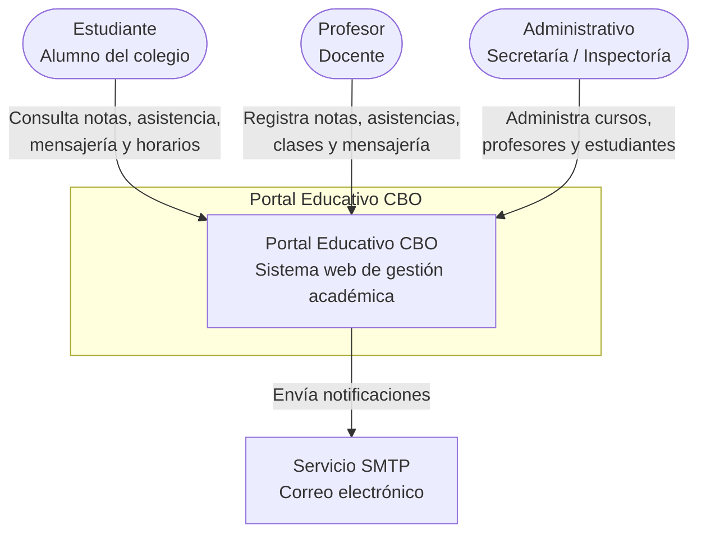

# C1 — Diagrama de Contexto

```mermaid
graph TB
    subgraph "Portal Educativo CBO"
        portal["Portal Educativo CBO<br/>Sistema web de gestión académica"]
    end

    est(["Estudiante<br/>Alumno del colegio"])
    prof(["Profesor<br/>Docente"])
    admin(["Administrativo<br/>Secretaría / Inspectoría"])

    smtp["Servicio SMTP<br/>Correo electrónico"]

    est -->|"Consulta notas, asistencia,<br/>mensajería y horarios"| portal
    prof -->|"Registra notas, asistencias,<br/>clases y mensajería"| portal
    admin -->|"Administra cursos,<br/>profesores y estudiantes"| portal
    portal -->|"Envía notificaciones"| smtp
```
