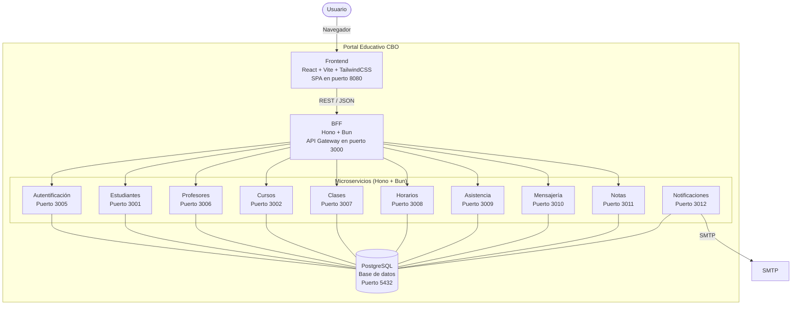

# C2 — Diagrama de Contenedores

```mermaid
graph TB
    subgraph "Portal Educativo CBO"
        frontend["Frontend<br/>React + Vite + TailwindCSS<br/>SPA en puerto 8080"]
        bff["BFF<br/>Hono + Bun<br/>API Gateway en puerto 3000"]
        db[("PostgreSQL<br/>Base de datos<br/>Puerto 5432")]

        subgraph "Microservicios (Hono + Bun)"
            ms_auth["Autentificación<br/>Puerto 3005"]
            ms_est["Estudiantes<br/>Puerto 3001"]
            ms_prof["Profesores<br/>Puerto 3006"]
            ms_cursos["Cursos<br/>Puerto 3002"]
            ms_clases["Clases<br/>Puerto 3007"]
            ms_hor["Horarios<br/>Puerto 3008"]
            ms_asist["Asistencia<br/>Puerto 3009"]
            ms_msj["Mensajería<br/>Puerto 3010"]
            ms_notas["Notas<br/>Puerto 3011"]
            ms_notif["Notificaciones<br/>Puerto 3012"]
        end
    end

    smtp["SMTP"]

    usuario(["Usuario"])

    usuario -->|"Navegador"| frontend
    frontend -->|"REST / JSON"| bff

    bff --> ms_auth
    bff --> ms_est
    bff --> ms_prof
    bff --> ms_cursos
    bff --> ms_clases
    bff --> ms_hor
    bff --> ms_asist
    bff --> ms_msj
    bff --> ms_notas

    ms_notif -->|"SMTP"| smtp

    ms_auth --- db
    ms_est --- db
    ms_prof --- db
    ms_cursos --- db
    ms_clases --- db
    ms_hor --- db
    ms_asist --- db
    ms_msj --- db
    ms_notas --- db
    ms_notif --- db
```
