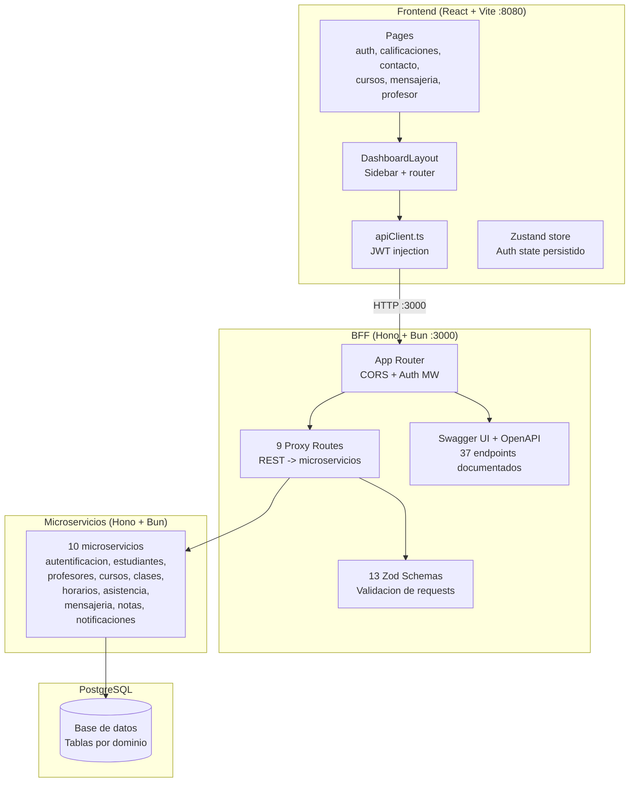

# C3 — Diagrama de Componentes

```mermaid
graph TB
    subgraph "Frontend (React + Vite :8080)"
        pages["Pages<br/>auth, calificaciones, contacto,<br/>cursos, mensajeria, profesor"]
        layout["DashboardLayout<br/>Sidebar + router"]
        api["apiClient.ts<br/>JWT injection"]
        store["Zustand store<br/>Auth state persistido"]
    end

    subgraph "BFF (Hono + Bun :3000)"
        router["App Router<br/>CORS + Auth MW"]
        routes["9 Proxy Routes<br/>REST -> microservicios"]
        swagger["Swagger UI + OpenAPI<br/>37 endpoints documentados"]
        dtos["13 Zod Schemas<br/>Validacion de requests"]
    end

    subgraph "Microservicios (Hono + Bun)"
        ms["10 microservicios<br/>autentificacion, estudiantes,<br/>profesores, cursos, clases,<br/>horarios, asistencia,<br/>mensajeria, notas, notificaciones"]
    end

    subgraph "PostgreSQL"
        db[("Base de datos<br/>Tablas por dominio")]
    end

    pages --> layout
    layout --> api
    api -->|"HTTP :3000"| router
    router --> routes
    router --> swagger
    routes --> dtos
    routes --> ms
    ms --> db
```
